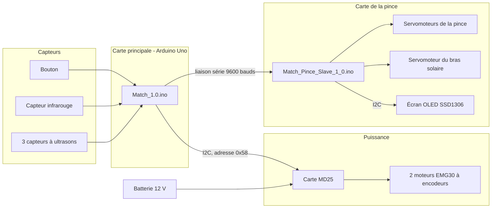
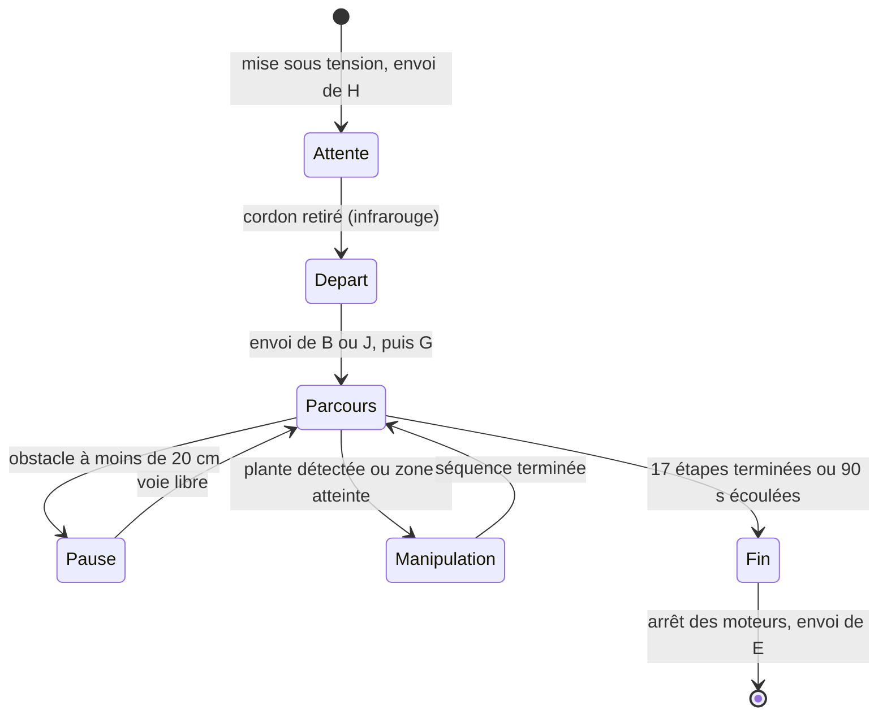

# Farming Mars — robot pour la Coupe de France de robotique 2024

Robot mobile autonome à base Arduino, conçu en équipe pour l'édition 2024 de la Coupe de France de robotique (thème « Farming Mars »). Il enchaîne un parcours programmé, s'arrête devant les obstacles, saisit et dépose des plantes avec une pince, et oriente des panneaux solaires.


*La table de jeu : 3 m × 2 m, avec les zones de départ, les plantes et les panneaux solaires en bordure.*

## Sommaire

1. [Contexte et cahier des charges](#1-contexte-et-cahier-des-charges)
2. [Stratégie de match](#2-stratégie-de-match)
3. [Ma contribution](#3-ma-contribution)
4. [Architecture du système](#4-architecture-du-système)
5. [Base roulante et commande des moteurs](#5-base-roulante-et-commande-des-moteurs)
6. [Détection d'obstacles](#6-détection-dobstacles)
7. [Pince et protocole de communication](#7-pince-et-protocole-de-communication)
8. [Logiciel de match](#8-logiciel-de-match)
9. [Installation et utilisation](#9-installation-et-utilisation)
10. [Essais, limites et améliorations](#10-essais-limites-et-améliorations)
11. [Organisation du dépôt](#11-organisation-du-dépôt)

## 1. Contexte et cahier des charges

- **Cadre** : projet de robotique du cycle ingénieur, Sup Galilée (Université Sorbonne Paris Nord), année 2023–2024.
- **Équipe** : huit étudiants répartis en sous-groupes (base roulante, capteurs, robot secondaire puis pince).
- **Règlement** : [Eurobot 2024, Coupe de France](https://www.coupederobotique.fr/wp-content/uploads/Eurobot2024_Rules_CUP_FR_FINAL.pdf).

Contraintes principales du règlement prises en compte :

| Contrainte | Valeur |
|---|---|
| Aire de jeu | 3000 mm × 2000 mm, bordures de 70 mm |
| Durée d'un match | 100 s |
| Robot principal | périmètre ≤ 1200 mm au départ, ≤ 1300 mm déployé, hauteur ≤ 350 mm |
| Robot secondaire | zone de départ 150 mm × 450 mm, hauteur ≤ 150 mm, masse ≤ 1,5 kg |
| Sécurité | arrêt d'urgence, évitement de l'adversaire, départ par cordon |
| Équipes | bleue ou jaune, parcours symétriques |

## 2. Stratégie de match

L'équipe a retenu les actions les plus rentables au regard de leur difficulté, et réalisables de façon symétrique pour les deux couleurs.

| Action | Points visés |
|---|---|
| Orienter les 6 panneaux solaires | 30 |
| Récupérer une plante | 5 |
| Amener la plante en zone de dépôt | 5 |
| Mettre le robot secondaire au contact de la plante | 3 |
| **Total visé pour un match idéal** | **43** |

Ce total est un objectif de conception, pas un score obtenu.

## 3. Ma contribution

J'ai travaillé dans le sous-groupe chargé de la **base roulante** : châssis, moteurs EMG30, carte de commande MD25, alimentation 12 V, et commande des déplacements depuis l'Arduino par écriture dans les registres de la MD25.

Les programmes de ce dépôt sont un travail d'équipe. Le robot secondaire Lego et la pince ont été réalisés par d'autres sous-groupes.

## 4. Architecture du système

Le robot repose sur deux cartes Arduino. La carte principale décide et se déplace ; la carte de la pince exécute les actions de manipulation et affiche l'état du robot.



| Élément | Détail |
|---|---|
| Carte principale | Arduino Uno (ATmega328) |
| Motorisation | 2 moteurs à encodeur EMG30, carte MD25 (double pont en H) |
| Alimentation | Batterie 12 V |
| Détection d'obstacles | 3 capteurs à ultrasons |
| Démarrage et détection de plante | Capteur infrarouge |
| Manipulation | Pince à servomoteurs du commerce, bras « panneau solaire » |
| Affichage | Écran OLED SSD1306 |
| Robot secondaire | Lego, suivi de ligne (capteurs de couleur, d'ultrasons et de contact), programmé en Python — code non inclus |

Brochage de la carte principale, relevé dans le code :

| Fonction | Broche |
|---|---|
| Ultrason 1 (Trig / Echo) | 2 / 3 |
| Ultrason 2 (Trig / Echo) | 8 / 9 |
| Ultrason 3 (signal unique) | 10 |
| Capteur infrarouge | 4 |
| Bouton | 6 |
| LED | 13 |
| MD25 | bus I2C (SDA / SCL) |
| Carte de la pince | liaison série (TX / RX) |

## 5. Base roulante et commande des moteurs


*Dessous du châssis : les deux moteurs EMG30, la carte MD25 et le capteur infrarouge.*

Le châssis porte deux roues motrices indépendantes. Le robot avance quand les deux moteurs tournent à la même vitesse et pivote quand un seul est entraîné.

La carte MD25 se pilote par I2C : l'Arduino écrit une consigne dans un registre par moteur.

| Registre | Adresse | Rôle |
|---|---|---|
| `SPEED1` | 0x00 | Consigne de vitesse du moteur 1 |
| `SPEED2` | 0x01 | Consigne de vitesse du moteur 2 |
| `ENCODERONE` | 0x02 | Compteur de l'encodeur 1 (4 octets) |
| `ENCODERTWO` | 0x06 | Compteur de l'encodeur 2 (4 octets) |
| `VOLTREAD` | 0x0A | Tension batterie, en dixièmes de volt |

Consignes utilisées (128 correspond à l'arrêt) :

| Mouvement | Moteur 1 | Moteur 2 |
|---|---|---|
| Avancer | 175 | 175 |
| Pivoter d'un côté | 140 | 128 |
| Pivoter de l'autre | 128 | 140 |
| Arrêt | 128 | 128 |

**Choix de commande.** Les déplacements sont temporisés : chaque étape dure un temps fixe. Les fonctions `readEncoder()` et `readBatteryVoltage()` sont écrites, mais elles ne sont pas utilisées pour asservir la position. Ce choix simplifie le programme ; il rend la trajectoire sensible à la charge de la batterie et à l'adhérence.


*Carte MD25 : en vert, les connecteurs utilisés.*

## 6. Détection d'obstacles

Trois capteurs à ultrasons sont interrogés à chaque itération de la boucle de déplacement. La distance est déduite du temps de vol aller-retour :

```
distance (cm) = durée de l'écho (µs) × 0,0343 / 2
```

Si l'une des trois distances passe sous **20 cm**, le robot s'arrête et envoie `S` à la carte de la pince, qui l'affiche.

Le temps passé à l'arrêt n'est pas compté dans la durée de l'étape : le programme mémorise l'instant du début de pause et retranche la durée totale des pauses du temps écoulé. Après un arrêt, le robot reprend donc l'étape là où il l'avait laissée, au lieu de la raccourcir.


*Capteur à ultrasons à l'avant du châssis, sous la pince.*

## 7. Pince et protocole de communication

La carte principale envoie un caractère sur la liaison série ; la carte de la pince exécute l'action et affiche un message.


*Schéma de la liaison entre la carte principale et la carte de la pince.*

| Caractère | Émis quand | Action de la pince | Affichage |
|---|---|---|---|
| `H` | À la mise sous tension | Position par défaut | Homologation |
| `C` | Cordon de démarrage retiré | — | — |
| `B` / `J` | Juste après le départ | Bras solaire orienté côté bleu / jaune | Panneaux B / Panneaux J |
| `G` | Début du parcours | — | Go ! |
| `S` | Obstacle détecté | — | — |
| `A` | Plante détectée par l'infrarouge | Séquence « attraper » | Attraper |
| `D` | Arrivée en zone de dépôt | Séquence « déposer » | Deposer |
| `O` | Fin d'une étape | Retour en position par défaut | Defaut |
| `R` | Sur demande | Servomoteurs détachés | Repos |
| `E` | Fin du parcours | — | End |

Les caractères `C` et `S` sont émis par la carte principale mais ne déclenchent pas d'action dans la version 1.0 du programme de la pince.

**Séquence « attraper »** : ouverture de la pince, rotation de la base, descente progressive du bras (par pas de 1° toutes les 20 ms pour éviter les à-coups), fermeture, remontée. La carte principale attend 6 s pendant cette séquence.

## 8. Logiciel de match

### Déroulement



### Parcours programmé

Le parcours compte 17 étapes. Les lignes droites sont communes aux deux équipes ; les rotations existent en deux versions symétriques. La variable `bleue`, en tête de `Match_1.0.ino`, choisit le parcours.

| Étape | Mouvement | Durée nominale | Action |
|---|---|---|---|
| 1 | Avancer | 10 s | Panneaux solaires |
| 2 | Tourner de 90° | 5 s | |
| 3 | Avancer | 2 s | |
| 4 | Tourner de 90° | 5 s | |
| 5 | Avancer | 1 s | Attraper une plante |
| 6 | Avancer | 7 s | |
| 7 | Tourner de 90° | 5 s | |
| 8 | Avancer | 1 s | Déposer la plante |
| 9 | Demi-tour | 10 s | |
| 10 | Avancer | 5 s | |
| 11 | Tourner de 90° | 5 s | |
| 12 | Avancer | 6 s | Attraper une plante |
| 13 | Demi-tour | 10 s | |
| 14 | Avancer | 6 s | |
| 15 | Tourner de 90° | 5 s | |
| 16 | Avancer | 3 s | |
| 17 | Tourner de 90° | 5 s | Déposer la plante |

### Budget temps

Le programme coupe les moteurs 10 s avant la fin du match, soit à 90 s. Avec les durées nominales ci-dessus, le parcours complet demande environ 91 s de déplacement, auxquelles s'ajoutent les temps de manipulation. Les durées de rotation portent la mention « à définir » dans le code : ce sont des valeurs provisoires, et le parcours complet ne tient pas dans le temps imparti tant qu'elles ne sont pas réduites.

### Programme d'homologation

`Homologation_1.0.ino` est une version réduite : départ au cordon, ligne droite, rotation et arrêt sur obstacle. Elle sert à démontrer l'évitement exigé pour être admis en match.

## 9. Installation et utilisation

1. Installer l'IDE Arduino.
2. Pour la carte de la pince, installer les bibliothèques `Adafruit GFX` et `Adafruit SSD1306`.
3. Téléverser `arduino/Match_1.0/` sur la carte principale et `arduino/Match_Pince_Slave_1_0/` sur la carte de la pince.
4. Régler la variable `bleue` dans `Match_1.0.ino` : `TRUE` pour l'équipe bleue, `FALSE` pour l'équipe jaune.
5. Poser le robot en zone de départ, mettre le cordon en place, puis le retirer au signal.

> La compilation et le téléversement n'ont pas été rejoués lors de la mise en forme de ce dépôt.

## 10. Essais, limites et améliorations

**Essais.** Le robot a été préparé pour l'homologation et les matchs de l'édition 2024. Le rapport de projet disponible est une version de travail : il ne contient ni résultats de match ni mesures. Aucun score n'est donc annoncé ici.

**Limites identifiées dans le code.**

| Limite | Conséquence | Amélioration possible |
|---|---|---|
| Déplacements temporisés | Dérive selon la batterie et le sol | Asservir la distance et l'angle avec les encodeurs, déjà lisibles par `readEncoder()` |
| Durées de rotation provisoires | Angles approximatifs, budget temps dépassé | Étalonner les rotations, ou les mesurer aux encodeurs |
| Mesures à ultrasons bloquantes (`pulseIn`) | Boucle ralentie quand rien n'est détecté | Ajouter un délai maximal aux mesures |
| Même bloc de code recopié pour chaque étape | Programme long (environ 1 650 lignes), corrections à répéter | Une fonction commune « avancer » et une « tourner », paramétrées |
| Liaison série sans accusé de réception | Une commande perdue passe inaperçue | Faire répondre la pince en fin de séquence |

## 11. Organisation du dépôt

```
arduino/Match_1.0/                  Programme de match (carte principale, équipes bleue et jaune)
arduino/Homologation_1.0/           Programme d'homologation (carte principale)
arduino/Match_Pince_Slave_1_0/      Programme de la pince pour le match (avec écran OLED)
arduino/Pince_arduino_uno_2_0_0/    Programme de mise au point de la pince, sans écran
arduino/Asservissement_pince/       Premiers essais de pilotage de la pince
assets/                             Photos du robot, de la table et schéma de liaison
```

### Autres photos

| | |
|---|---|
|  |  |
| *Câblage de la MD25 vers un moteur EMG30* | *Robot secondaire Lego sur la table* |

## Crédits et licence

- Programmes de mise au point de la pince dérivés de l'exemple `servo.ino` d'Adeept (en-tête d'origine conservé).
- Projet encadré à Sup Galilée et réalisé par un groupe de huit étudiants.
- Aucune licence n'a été définie pour ce code d'équipe.
