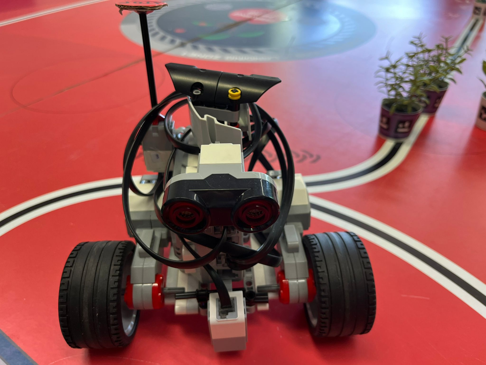

# Farming Mars — robot pour la Coupe de France de robotique 2024

Robot mobile à base Arduino construit en équipe pour l'édition 2024 de la Coupe de France de robotique, dont le thème était « Farming Mars » : déplacer des plantes, orienter des panneaux solaires et amener un petit robot secondaire au contact d'une plante.


*Dessous de la base roulante : les deux moteurs EMG30, la carte de commande MD25 et le capteur infrarouge.*

## Objectif et contexte

- **Cadre** : projet de robotique du cycle ingénieur, Sup Galilée (Université Sorbonne Paris Nord), année 2023–2024.
- **Équipe** : groupe de huit étudiants, réparti en sous-groupes (base roulante, capteurs, robot secondaire puis pince).
- **Règlement** : [Eurobot 2024, Coupe de France](https://www.coupederobotique.fr/wp-content/uploads/Eurobot2024_Rules_CUP_FR_FINAL.pdf).

Stratégie retenue par l'équipe : tourner les panneaux solaires, saisir une plante, la déposer dans la zone prévue, puis faire venir le robot secondaire (la « coccinelle ») au contact de la plante.

## État du projet

Projet terminé (mai 2024). Le code présent ici est la version 1.0 des programmes d'homologation et de match. Le rapport de projet disponible est une version de travail : les parties « première rencontre » et « conclusion » n'y sont pas rédigées.

## Ma contribution

J'ai travaillé dans le sous-groupe chargé de la **base roulante** : châssis, moteurs EMG30, carte de commande MD25 et alimentation 12 V, ainsi que la commande des déplacements depuis l'Arduino.

Les programmes de ce dépôt sont un travail d'équipe. Le robot secondaire Lego et la pince ont été réalisés par d'autres sous-groupes.

## Matériel et technologies

| Élément | Détail |
|---|---|
| Carte principale | Arduino Uno (ATmega328) |
| Motorisation | 2 moteurs à encodeur EMG30, carte de commande MD25 pilotée en I2C (adresse 0x58) |
| Alimentation | Batterie 12 V |
| Détection d'obstacles | 3 capteurs à ultrasons (deux à broches Trig/Echo, un à broche unique SIG) |
| Autres capteurs | Capteur infrarouge (cordon de démarrage et détection de plante), bouton |
| Pince | Bras à servomoteurs du commerce, piloté par une seconde carte Arduino |
| Robot secondaire | Lego (capteurs de couleur, d'ultrasons et de contact), programmé en Python — code non inclus |
| Langage et outil | C++ Arduino, IDE Arduino, bibliothèques `Wire` et `Servo` |

## Fonctionnement

### Deux cartes qui dialoguent

La carte principale gère les déplacements et les capteurs. Elle envoie des ordres d'un caractère sur la liaison série à la carte de la pince, qui exécute l'action correspondante.


*Schéma de la liaison entre la carte principale et la carte de la pince.*

Ordres reconnus par `Pince_arduino_uno_2_0_0.ino` :

| Caractère | Action de la pince |
|---|---|
| `O` | Position par défaut |
| `R` | Repos (servomoteurs détachés) |
| `B` / `J` | Bras « panneau solaire » orienté pour l'équipe bleue / jaune |
| `A` | Attraper une plante |
| `D` | Déposer une plante |
| `T` | Test |

### Déplacements

La carte MD25 reçoit une consigne de vitesse par moteur (128 = arrêt). Dans le programme de match, les déplacements sont **temporisés** : chaque étape du parcours avance ou tourne pendant une durée fixe. Les fonctions de lecture des encodeurs et de la tension batterie existent dans le code, mais ne sont pas utilisées pour corriger la trajectoire.

### Programme de match (`Match_1.0.ino`)

1. Attente du retrait du cordon de démarrage, détecté par le capteur infrarouge.
2. Positionnement du bras selon la couleur de l'équipe (variable `bleue`).
3. Enchaînement de 17 étapes (avancer, tourner, attraper, déposer), avec une version symétrique pour chaque équipe.
4. À chaque étape, mesure des trois capteurs à ultrasons : si un obstacle est à moins de 20 cm, le robot s'arrête et le temps de pause est décompté de l'étape.
5. Arrêt au plus tard 90 secondes après le départ, pour un match de 100 secondes.

### Programme d'homologation (`Homologation_1.0.ino`)

Version réduite utilisée pour l'homologation : départ au cordon, avance, rotation et arrêt sur obstacle.


*Capteur à ultrasons à l'avant du châssis, sous la pince.*

## Organisation du dépôt

```
arduino/Match_1.0/                  Programme de match (carte principale)
arduino/Homologation_1.0/           Programme d'homologation (carte principale)
arduino/Pince_arduino_uno_2_0_0/    Programme de la pince, piloté par la liaison série
arduino/Asservissement_pince/       Version antérieure du programme de la pince
assets/                             Photos du robot et schéma de liaison
```

## Installation et utilisation

1. Installer l'IDE Arduino.
2. Ouvrir le dossier du programme voulu (`arduino/Match_1.0/`, par exemple).
3. Choisir la carte et le port, puis téléverser.
4. Avant un match, régler la variable `bleue` dans `Match_1.0.ino` selon la couleur de l'équipe.

Brochage de la carte principale (d'après le code) : ultrasons sur 2/3, 8/9 et 10 ; infrarouge sur 4 ; bouton sur 6 ; MD25 sur le bus I2C.

> La compilation et le téléversement n'ont pas été rejoués lors de la mise en forme de ce dépôt. Les durées de rotation portent encore la mention « à définir » dans le code.

## Essais et résultats

Le robot a été préparé pour l'homologation et les matchs de l'édition 2024. Le rapport disponible ne contient pas de résultats de match ni de mesures : aucun score n'est donc annoncé ici.

## Limites

- Déplacements temporisés, sans asservissement en position : la trajectoire dépend de la batterie et du sol.
- Durées de rotation à ajuster (constantes marquées « à définir »).
- Le programme de match répète le même bloc de code pour chacune des 17 étapes ; une fonction commune le rendrait plus court et plus sûr.
- Le code du robot secondaire Lego n'est pas dans ce dépôt.

## Photos

| | |
|---|---|
|  |  |
| *Carte MD25 et connecteurs utilisés* | *Câblage de la MD25 vers un moteur EMG30* |
|  |  |
| *Robot secondaire Lego, version à chenilles* | *Robot secondaire Lego, version à roues* |

## Crédits

- Programmes de la pince dérivés de l'exemple `servo.ino` d'Adeept (en-tête d'origine conservé).
- Projet encadré à Sup Galilée et réalisé par un groupe de huit étudiants.

## Licence

Aucune licence n'a été définie pour ce code d'équipe.
