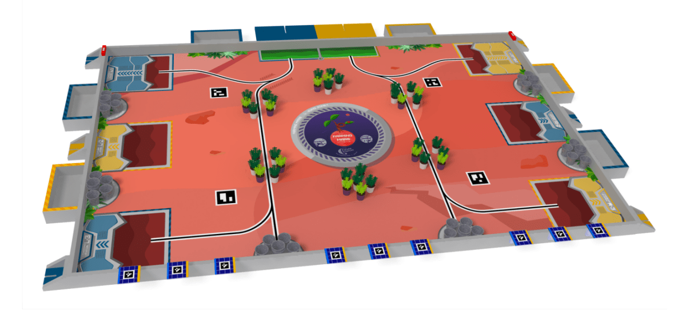
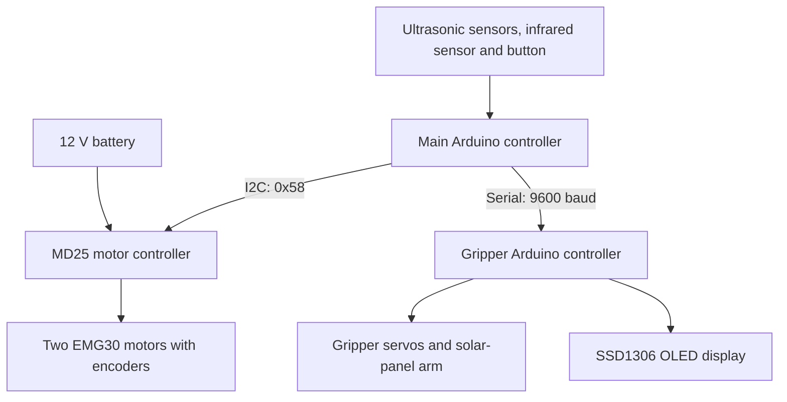
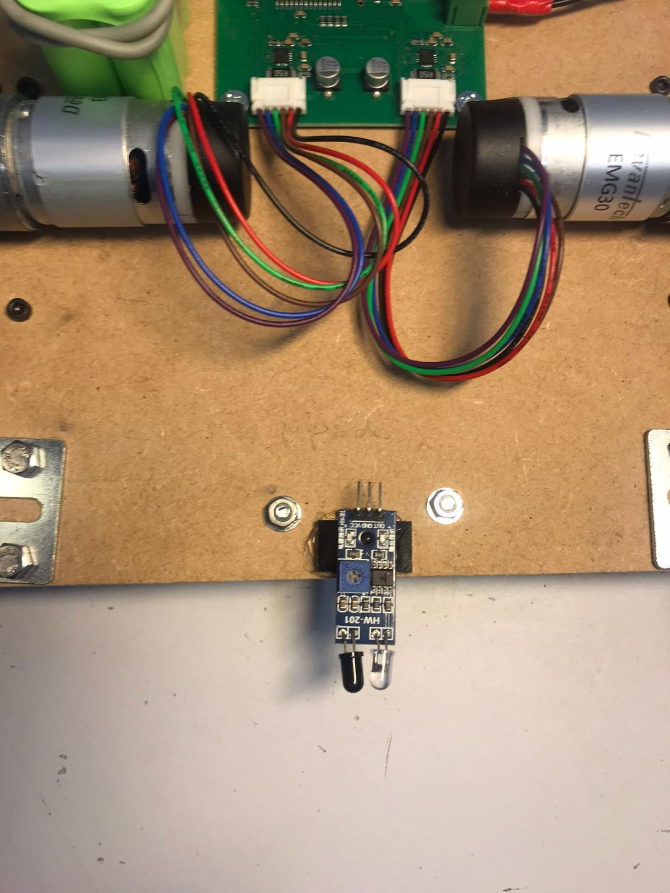
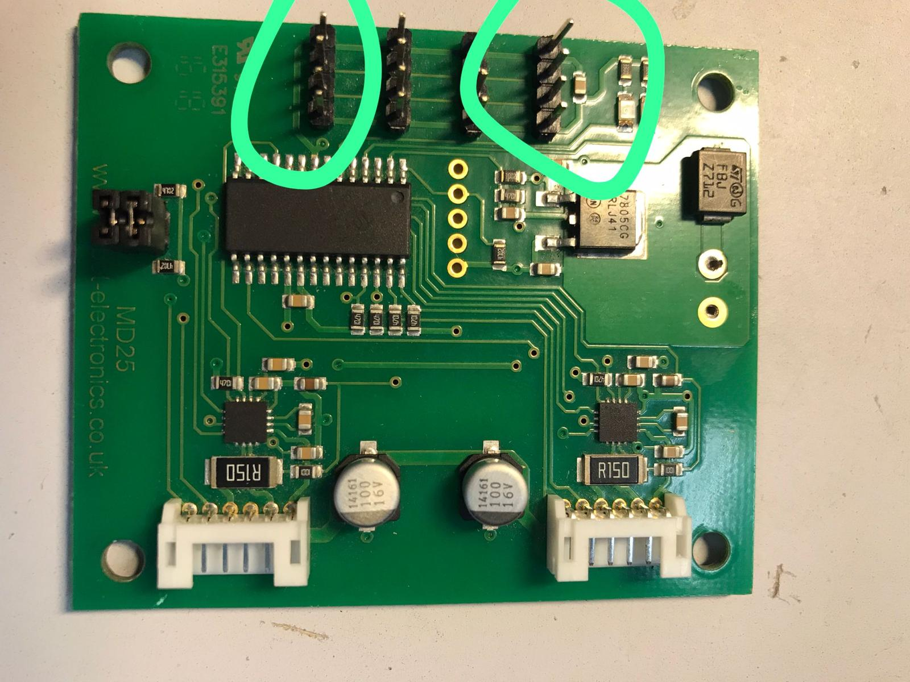
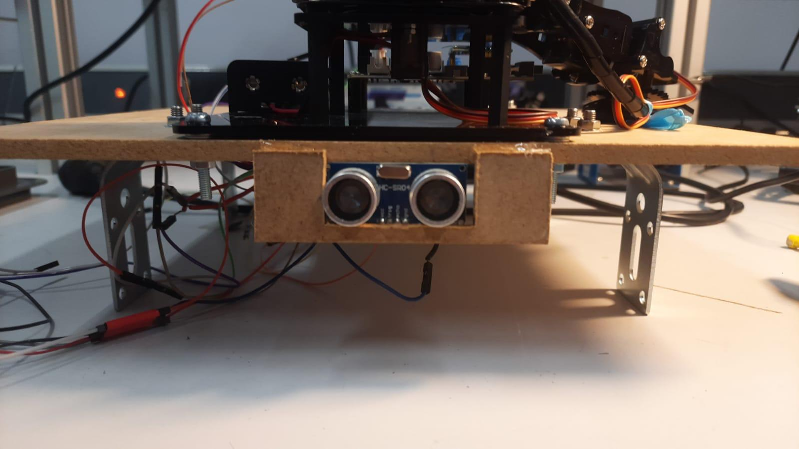
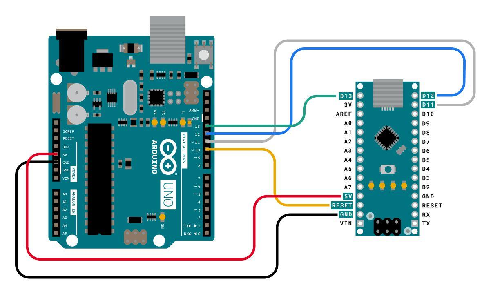
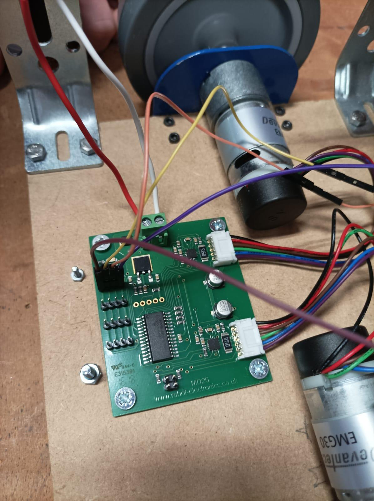
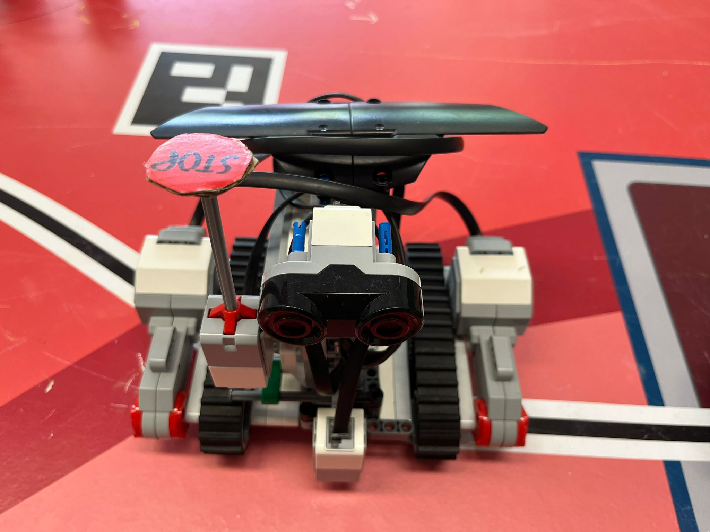

# Farming Mars — Competition Robotics Project

An Arduino-based mobile robot developed for the **2024 French Robotics Cup**, under the “Farming Mars” theme. The system combines a differential-drive chassis, ultrasonic obstacle detection, a servo-operated gripper and a solar-panel arm to execute a predefined competition route.

**Arduino C/C++ · I²C · Serial Communication · Motor Control · Ultrasonic Sensing · Servo Integration**



*The 3 m × 2 m playing field, including starting areas, plants and solar panels.*

## Project Overview

| Item | Details |
|---|---|
| Context | Engineering robotics project, Sup Galilée, Université Sorbonne Paris Nord, 2023–2024 |
| Team | Eight students working across drivetrain, sensors, manipulation and secondary-robot subsystems |
| Competition | French Robotics Cup 2024 — Farming Mars |
| Main platform | Arduino-controlled mobile robot with MD25 motor controller and EMG30 motors |
| Repository | Match sketches, subsystem experiments, integration photos and project documentation |

The robot uses timed motion sequences and reactive obstacle stopping. Encoder-reading functions are available, but the match route does not use encoder-based position feedback.

## My Contribution

I worked in the **drivetrain subgroup**, covering the chassis, EMG30 motors, MD25 controller, 12 V power supply and movement commands issued from Arduino through MD25 register writes.

The firmware and system integration are team work. Other subgroups developed the gripper and the Lego secondary robot. The repository retains subsystem experiments to show the progression from individual component tests to integration.

## Competition Strategy

The team selected actions based on expected score, implementation difficulty and the ability to mirror the route for blue and yellow starting positions.

| Planned action | Target points |
|---|---|
| Orient six solar panels | 30 |
| Collect a plant | 5 |
| Deliver the plant to a deposit area | 5 |
| Bring the secondary robot into contact with a plant | 3 |
| **Ideal design target** | **43** |

The table is the strategy's scoring budget: it shows how the team prioritised actions by value and integration difficulty. It represents the target used to choose the route.

[Original 2024 competition rules — PDF, French](https://www.coupederobotique.fr/wp-content/uploads/Eurobot2024_Rules_CUP_FR_FINAL.pdf)

## System Architecture

The main controller handles movement, obstacle sensing and route sequencing. A second Arduino executes manipulation commands and drives an OLED status display.



| Subsystem | Implementation |
|---|---|
| Main controller | Arduino Uno |
| Drive | Two EMG30 motors with encoders; MD25 dual motor controller |
| Power | 12 V battery |
| Obstacle detection | Three ultrasonic sensors |
| Start and plant sensing | Infrared sensor |
| Motion enable | Button configured with an internal pull-up |
| Manipulation | Servo-operated gripper and solar-panel arm |
| Status display | SSD1306 OLED |
| Secondary robot | Lego line-following platform; Python code is not included |

### Main-Controller Pin Map

| Function | Pin |
|---|---|
| Ultrasonic sensor 1: TRIG / ECHO | 2 / 3 |
| Ultrasonic sensor 2: TRIG / ECHO | 8 / 9 |
| Ultrasonic sensor 3: shared signal | 10 |
| Infrared sensor | 4 |
| Button | 6 |
| LED | 13 |
| MD25 interface | I²C SDA / SCL |
| Gripper interface | Hardware serial TX / RX |

## Drivetrain and Motor Control



*Chassis underside showing the drivetrain and infrared sensor.*

Arduino communicates with the MD25 through I²C. Separate speed registers command the two motors; matching commands drive forward, while driving one motor with the other stopped produces a pivot.

| Register | Address | Purpose |
|---|---|---|
| `SPEED1` | `0x00` | Motor 1 speed command |
| `SPEED2` | `0x01` | Motor 2 speed command |
| `ENCODERONE` | `0x02` | Encoder 1 count, four bytes |
| `ENCODERTWO` | `0x06` | Encoder 2 count, four bytes |
| `VOLTREAD` | `0x0A` | Battery voltage in tenths of a volt |

The match code uses 128 for stop, 175 for forward motion and 140 for the moving motor during pivots. Functions for reading encoders and battery voltage are present, but do not close the loop on distance or angle.



*MD25 controller and annotated connectors.*

## Obstacle Detection and Timing

The three ultrasonic sensors are sampled during motion. Distance is estimated from echo duration:

```text
distance_cm = echo_duration_us × 0.0343 / 2
```

When any reported distance is below **20 cm**, the motion code stops the motors and emits the serial command `S`.

Obstacle-pause duration is excluded from the current segment's movement time, so the robot resumes the remaining timed motion when the path clears. The overall match clock continues to advance.

The implementation uses blocking `pulseIn()` calls without an explicitly configured timeout. A missing echo can therefore delay the control loop until the API's timeout; a returned zero is treated as a close obstacle by the current comparison.



*Ultrasonic sensor mounted at the front of the chassis.*

## Manipulation and Serial Protocol



*Original wiring diagram between the main and manipulation controllers.*

The main controller sends character commands at 9600 baud. The following table describes the handlers in [the OLED-enabled gripper sketch](arduino/Match_Pince_Slave_1_0/Match_Pince_Slave_1_0.ino).

| Command | Implemented action |
|---|---|
| `H` | Display the qualification message and set the default servo positions |
| `G` | Display the start message |
| `B` / `J` | Position the solar-panel arm for the blue / yellow team |
| `A` | Execute the plant-grasping sequence |
| `D` | Execute the plant-release sequence |
| `O` | Restore default positions |
| `R` | Detach the servos |
| `E` | Display the end message |
| `C` / `S` | Emitted by the main controller; no action handler in this gripper version |

Grasping opens the gripper, rotates its base, lowers the arm incrementally, closes the gripper and raises the arm. Incremental movements use approximately 20 ms per degree. The main match sketch reserves a fixed 6 s wait for grasping and 3 s for release, rather than waiting for an action-completion acknowledgement.

The sketches also print diagnostic text to the same serial interface. The receiver processes individual characters without message framing, which can mix diagnostic output with action commands.

## Match Software

### Start Conditions

The main sketch first detects the infrared start condition and sends the team-specific arm command. The route starts when the button input is LOW. Motion loops continue only while that input remains LOW.

This distinction matters when reproducing the robot: infrared detection alone does not launch the route in the current code.

### Route Sequencing

The program calls **17 route stages**, with mirrored turns for the two team colours. Set `bleue` to `TRUE` for blue or `FALSE` for yellow in the main sketch.

The intended sequence combines solar-panel interaction, forward motion, turns, plant collection and deposit. The code sets provisional 90° and 180° turn durations to 5 s and 10 s.

Motion loops check a **90 s elapsed-time condition**, leaving a nominal 10 s margin within a 100 s match. Blocking sensing and manipulation delays mean this check is not a guarantee of an exact whole-program shutdown at 90 s.

The intended motion schedule already totals about 91 s before manipulation and obstacle pauses. Names and timing constants also differ in places: for example, `path_3_forward_for_2s()` checks `SEC_3`. The full route needs timing reconciliation and calibration before repeatable execution can be claimed.

### Qualification Sketch

[Homologation_1.0.ino](arduino/Homologation_1.0/Homologation_1.0.ino) provides a reduced sequence for start handling, movement, turning and obstacle stopping.

## Repository Map

| Path | Purpose |
|---|---|
| [`arduino/Match_1.0/`](arduino/Match_1.0/) | Main-controller match program |
| [`arduino/Homologation_1.0/`](arduino/Homologation_1.0/) | Reduced qualification program |
| [`arduino/Match_Pince_Slave_1_0/`](arduino/Match_Pince_Slave_1_0/) | Gripper program with OLED status display |
| [`arduino/Pince_arduino_uno_2_0_0/`](arduino/Pince_arduino_uno_2_0_0/) | Alternative gripper-development version without OLED |
| [`arduino/Asservissement_pince/`](arduino/Asservissement_pince/) | Early serial-controlled gripper experiment |
| [`arduino/essais_base_roulante/`](arduino/essais_base_roulante/) | Ultrasonic, infrared, MD25, encoder and drivetrain integration tests |
| [`arduino/essais_pince/`](arduino/essais_pince/) | Servo and controller-communication experiments |
| [`arduino/VERSIONS_PINCE.md`](arduino/VERSIONS_PINCE.md) | Gripper version history, in French |
| `assets/` | Hardware photos, field illustration and wiring diagrams |
| `documentation/` | Report, presentation and component-selection note |

Despite its name, `Asservissement_pince` does not implement a custom closed-loop gripper controller. It issues position commands to servos.

## Setup and Use

1. Install the Arduino IDE and select the appropriate board and serial port for each controller.
2. Install the `Servo`, `Adafruit GFX` and `Adafruit SSD1306` libraries as required by the manipulation sketch. The main sketch uses `Wire` for I²C.
3. Open and upload the main sketch from `arduino/Match_1.0/`.
4. Open and upload the OLED-enabled manipulation sketch from `arduino/Match_Pince_Slave_1_0/`.
5. Check wiring against the source pin assignments and configure the team colour.
6. Confirm infrared-start detection and button-LOW motion enable before running the route.

The sketch pair above is the reference for the documented match architecture. Compare alternative gripper versions using their command handlers and servo sequences before selecting one for the assembled robot.

The `essais_*` directories contain multiple independent experiments. Open each experiment as a separate Arduino sketch rather than combining all `.ino` files in one build.

## Evaluation and Development Priorities

The integration work connects drivetrain register commands, obstacle checks, route timing and a second controller for manipulation. Separating these interfaces makes it possible to diagnose whether a route deviation originates in motion duration, sensing latency or manipulation synchronisation.

The media, source and report explain how the robot was assembled and how independently developed subsystems were coordinated into a competition strategy.

| Finding | Proposed improvement |
|---|---|
| Timed movement without encoder-based route feedback | Evaluate encoder-based distance and angle control |
| Provisional turn durations and mismatched stage constants | Reconcile the route definition and calibrate motion |
| Blocking sensing and manipulation | Define timeouts and use a non-blocking execution state machine |
| Repeated motion code across stages and colours | Use parameterized movement functions and a route table |
| Single-character serial parsing mixed with diagnostic text | Introduce framed messages and separate logging |
| Fixed waits without completion acknowledgement | Add action acknowledgement and timeout handling |
| Early drivetrain sketches contain partial encoder reads and truncated negative commands | Use the later register-reading approach and validate command encoding |

The early MD25 encoder experiment reads two bytes per count and uses incorrect register spacing; later integration versions read four bytes from `0x02` and `0x06`. Some early sketches call `Wire.write(-200)` or `Wire.write(-255)`, which transmit truncated byte values rather than signed reverse-speed commands. These files are retained as development history, not recommended operating firmware.

## Documentation

- [Project report — PDF, French](documentation/rapport_projet_robotique_2024.pdf)
- [Project presentation — PowerPoint, French](documentation/presentation_projet_robotique_2024.pptx)
- [Sensor and wheel selection note — Word, French](documentation/note_choix_capteurs_et_roues.docx)

## Hardware Gallery

| Drivetrain wiring | Secondary robot |
|---|---|
|  |  |

## Credits and Licensing

Developed by a team of eight students at Sup Galilée. Tedj El Moulk Sinacer contributed to the drivetrain subgroup.

Some gripper-development sketches derive from Adeept's `servo.ino` example and retain the original attribution. No project-wide licence has been specified for the team code.
